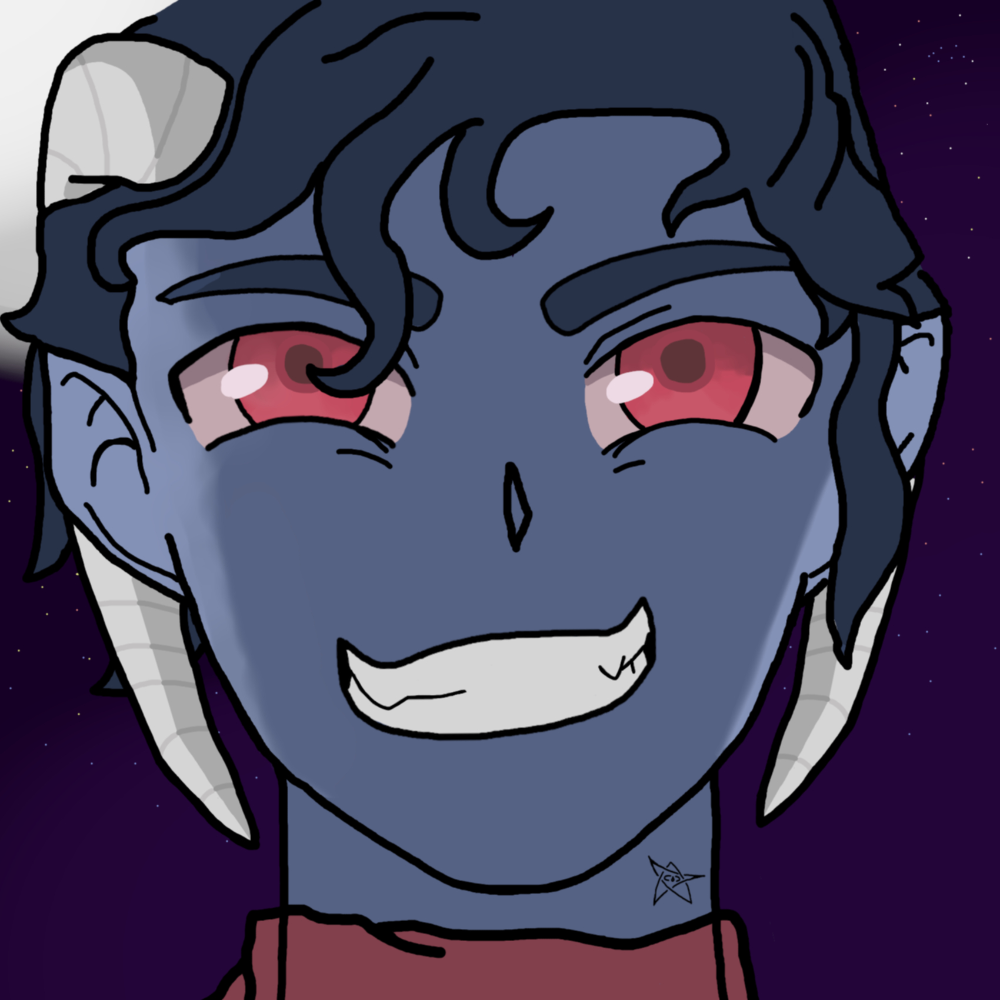
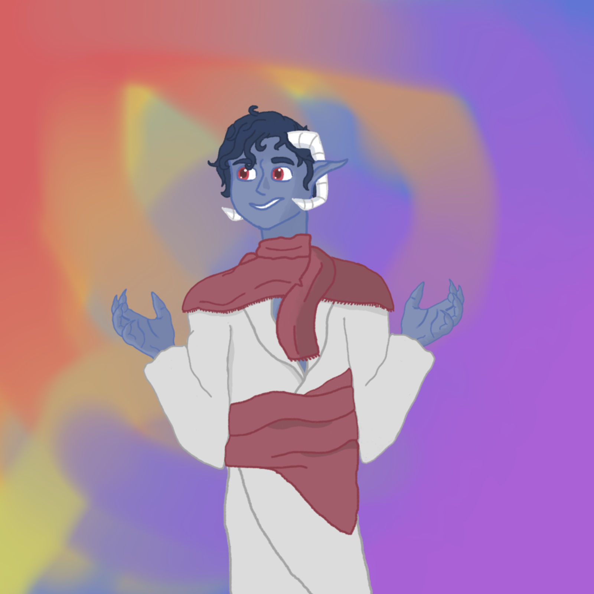

### Azool The Fifth is played by Patrick
---
### Class:
- It's Complicated

### Association:
- [The party](../The%20party.md)
- [Church of the Blind Devout](../%E2%98%85%20NPCs/Religions%20&%20Cults/The%20Blinding%20Eye/Church%20of%20the%20Blind%20Devout.md)

### Rank / Titles:
 - "The Illuminant"
 - "The Veiled Visionary"

### Description:

A Chthonic Tiefling. He's blue, with navy hair. He wears a brown/beige robe with a V-shaped neck that drops below the knees. Under this robe, he wears red pants, and over the top he wears a fabric scarf-like belt securing the robe. He wears a deep blue shirt that is nearly skin colour, contrasted by his bright white/light grey horns that curve into a near 90-degree angle, almost forming a sort of rectangle. 
Atop his head, he wears a bandanna decorated with 3 eyes. These eyes are red, blue and yellow. This bandanna typically covers his left eye, which has a red pupil. 

### History: 

